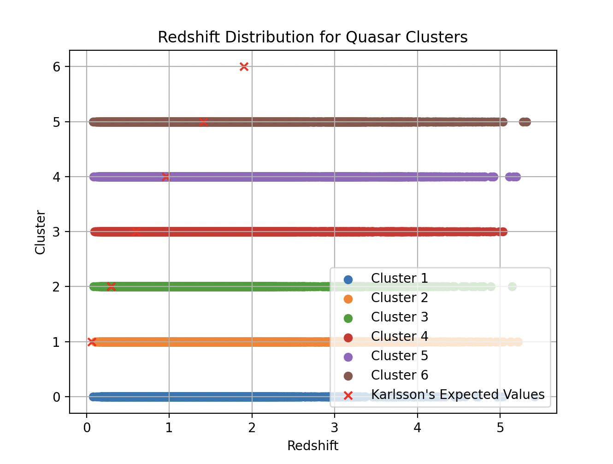
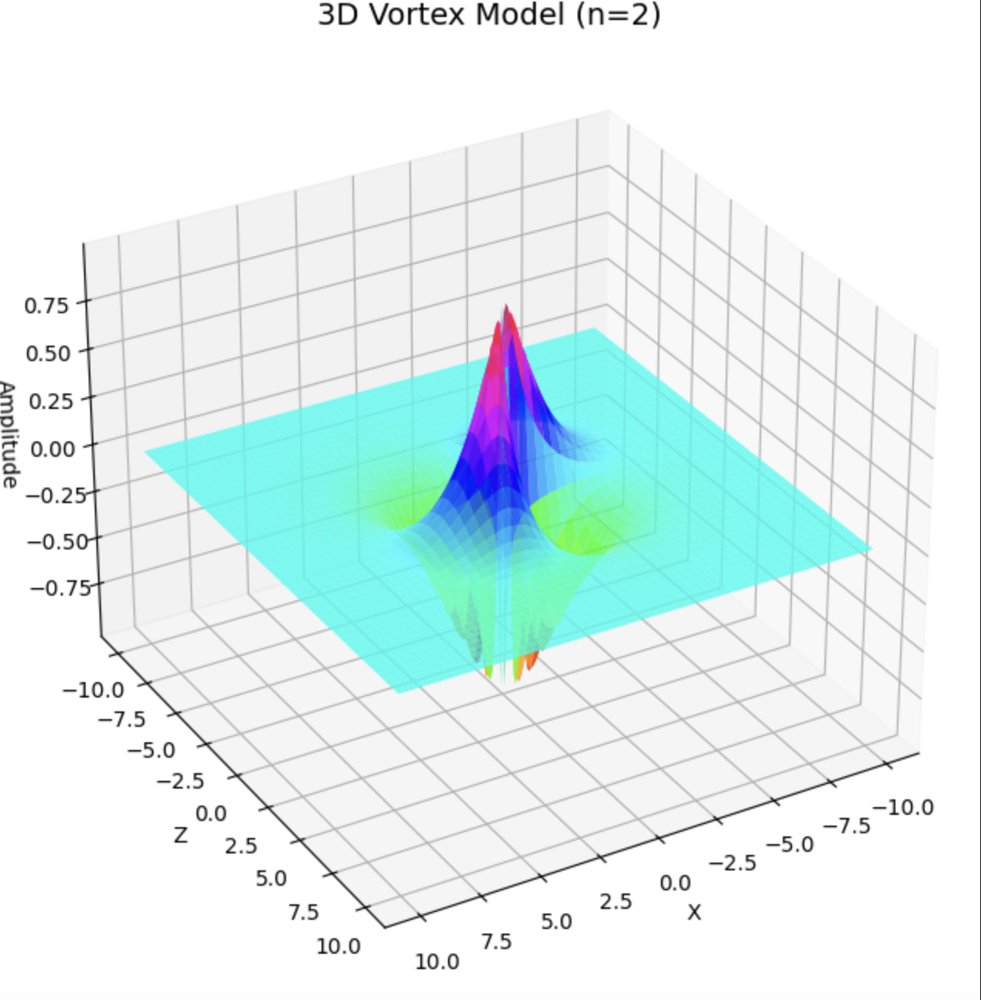

# random physics projects

- `Beta Decay-Inspired Eigensolver.ipynb`  
  A novel approach to eigensolving inspired by the energetics of nuclear beta decay, applying a tunable decay operator to variational quantum circuits.
  
- `Floquet Time Crystal.ipynb`  
  Simulates discrete time translation symmetry breaking using a kicked Ising model, inspired by proposals for quantum time crystals.

- `Grovers_KNN.ipynb`  
  Hybrid quantum-classical algorithm that combines Grover’s search with k-nearest neighbors for optimized search within small datasets.

- `Quantum-Candyland.ipynb`  
  A playful, educational quantum board game simulation designed to introduce young students to quantum gates and probabilistic evolution.

- `Redshift Quantization.py`  
  A cosmology-inspired script that explores the possibility of quantized redshift behavior across astronomical distances.

- `Superfluid_Vortex.ipynb`  
  Models quantized vortex dynamics in a superfluid system using discretized circulation, inspired by vortex quantization in helium-4.

---

---

## Folders

- `quantum-challenge/2023-qgss/`  
  Code and submissions from the Qiskit Global Summer School challenge.

- `qxq-hsrp-2024/`  
  Projects from a quantum summer research program, focusing on hybrid quantum-biology simulations and photonic computing.

- `qxq-ylc-2023-2024/`  
  Coursework and applied experiments from a yearlong quantum learning cohort.

